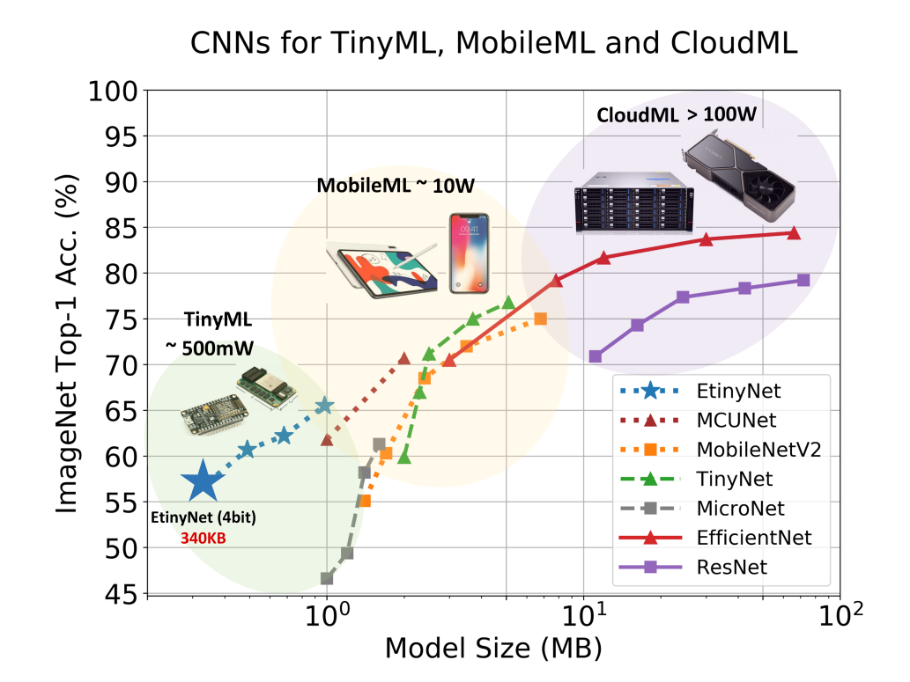

# AI - Edge Computing

## Onnxruntime

- https://leimao.github.io/blog/ONNX-Runtime-CPP-Inference/
- https://github.com/cassiebreviu/cpp-onnxruntime-resnet-console-app
- https://github.com/k2-gc/onnxruntime-cpp-example
- https://github.com/Rohithkvsp/OnnxRuntimeAndorid
- https://github.com/ifzhang/ByteTrack/blob/main/deploy/ONNXRuntime/onnx_inference.py
- https://huggingface.co/models?sort=trending&search=onnx
- https://neuml.github.io/txtai/pipeline/train/hfonnx/
- https://docs.ultralytics.com/modes/export/#arguments

### YOLO -NAS
- https://github.com/jason-li-831202/YOLO-NAS-onnxruntime

### QUANTIZATION
- https://github.com/microsoft/onnxruntime/tree/main/onnxruntime/python/tools/quantization
- https://onnxruntime.ai/docs/performance/model-optimizations/float16.html
- https://github.com/microsoft/onnxruntime-inference-examples/tree/main/quantization

### YOLO - TENSORRT - POSE - DETECT - SEGMENT

- https://www.youtube.com/watch?v=Z0n5aLmcRHQ
- https://github.com/cyrusbehr/YOLOv8-TensorRT-CPP
- https://github.com/cyrusbehr/tensorrt-cpp-api
- https://github.com/mattiasbax/yolo-pose_cpp
- https://github.com/triple-Mu/YOLOv8-TensorRT (Python + C++ + TensorRT)
- https://github.com/NVIDIA/TensorRT/tree/main/samples/trtexec

### YOLO - POSE - DETECT - SEGMENT - CLASSIFY
- https://github.com/FourierMourier/yolov8-onnx-cpp/tree/main (Python + C++)
- https://github.com/mallumoSK/yolov8/blob/master/yolo/YoloPose.cpp
- https://github.com/triple-Mu/YOLOv8-TensorRT/blob/main/csrc/pose/normal/main.cpp
- https://github.com/Amyheart/yolo-onnxruntime-cpp
- https://github.com/UNeedCryDear/yolov8-opencv-onnxruntime-cpp
- https://github.com/ultralytics/ultralytics/tree/main/examples/YOLOv8-ONNXRuntime-CPP
- https://github.com/hpc203/yolov6-opencv-onnxruntime/tree/main
- https://github.com/hpc203/yolov5_pose_opencv
- https://github.com/ultralytics/ultralytics/issues/1852

### FIXED BUGS
- https://github.com/ultralytics/yolov5/issues/916
- https://zhuanlan.zhihu.com/p/466677699
- https://github.com/hpc203?tab=repositories
- https://velog.io/@dnchoi/ONNX-runtime-install

### DOCUMENT ONNXRUNTIME
- https://pytorch.org/tutorials/advanced/super_resolution_with_onnxruntime.html
- https://onnxruntime.ai/docs/api/python/on_device_training/training_artifacts.html
- https://pytorch.org/tutorials/beginner/onnx/onnx_registry_tutorial.html
- https://github.com/NVIDIA/TensorRT/tree/main/samples/trtexec

### ONNXRUNTIME compatibility (ONNX, OPSET, TensorRT, CUDA, CUDNN)
- https://onnxruntime.ai/docs/reference/compatibility.html
- https://github.com/onnx/onnx/blob/main/docs/Versioning.md
- https://onnxruntime.ai/docs/execution-providers/CUDA-ExecutionProvider.html
  
## TENSORRT
- https://onnxruntime.ai/docs/execution-providers/TensorRT-ExecutionProvider.html#requirements
- https://gitee.com/arnoldfychen/onnxruntime/blob/master/docs/execution_providers/TensorRT-ExecutionProvider.md#specify-tensorrt-engine-cache-path

## FASTDEPLOY
- https://github.com/PaddlePaddle/FastDeploy
- https://github.com/PaddlePaddle/FastDeploy/blob/develop/docs/en/build_and_install/download_prebuilt_libraries.md

## DEEPSPARSE - SPARSEML
- https://neuralmagic.com/blog/benchmark-yolov5-on-cpus-with-deepsparse/
- https://github.com/neuralmagic/sparseml/tree/main
- https://github.com/neuralmagic/deepsparse
  
## MCU
- [MCU](https://mcunet.mit.edu/)
- [MCU-Net](https://github.com/mit-han-lab/mcunet)

## COMPRESSION
- https://github.com/AlgoHunt/VQRF

## OPENCV
- [openCV C++](https://www.youtube.com/playlist?list=PLUTbi0GOQwghR9db9p6yHqwvzc989q_mu)
- [Build-OpenCV-C++](https://gist.github.com/raulqf/f42c718a658cddc16f9df07ecc627be7)

## MACE
- [mace](https://github.com/xiaomi/mace)

## NCNN
- https://github.com/wkt/YoloMobile
- [ncnn](https://github.com/Tencent/ncnn)
- [nccn c++](https://github.com/Tencent/ncnn/blob/master/docs/how-to-use-and-FAQ/use-ncnn-with-alexnet.md)
- [convert model](https://convertmodel.com/)
- [awesome-ncnn-collection](https://github.com/umitkacar/awesome-ncnn-collection)

## COREML 
- https://github.com/tucan9389/SemanticSegmentation-CoreML
- https://github.com/john-rocky/CoreML-Models#u2net
- https://github.com/likedan/Awesome-CoreML-Models
- https://github.com/SwiftBrain/awesome-CoreML-models
- https://github.com/PeterL1n/RobustVideoMatting
- https://coremltools.readme.io/docs/pytorch-conversion
- https://github.com/hollance/CoreMLHelpers
- https://developer.apple.com/machine-learning/api/
- https://github.com/vladimir-chernykh/coreml-performance

#### CoreML - Stable Diffusion
- https://github.com/apple/ml-stable-diffusion
- https://huggingface.co/stabilityai/stable-diffusion-2-base [1]
- https://github.com/Stability-AI/stablediffusion [1]
- https://huggingface.co/CompVis/stable-diffusion-v1-4 [2]
- https://github.com/runwayml/stable-diffusion
- https://github.com/AUTOMATIC1111/stable-diffusion-webui

### Performance Tool
- [Performance Inference Time IOS](https://github.com/vladimir-chernykh/coreml-performance)

## LIGHTWEIGHT DETECTOR
- [PP-PicoDet: A Better Real-Time Object Detector on Mobile Devices ](https://arxiv.org/pdf/2111.00902.pdf)
- [EtinyNet](https://github.com/aztc/EtinyNet)
- 

## TVM
- https://github.com/apache/tvm
  
## LLVM
- https://github.com/llvm/llvm-project

## ARM-NN
- https://github.com/ARM-software/armnn
- https://www.youtube.com/watch?v=QuNOaFLobSg

## CMSIS-NN
- https://github.com/ARM-software/CMSIS_5

## RISC-V

## ARM

## OpenCL

## Vulkan

## Cuda

## Metal

## XNNPack
- https://github.com/google/XNNPACK

## Samsung ONE (On-device Neural Engine)
- https://github.com/Samsung/ONE

## COMPANY

- https://www.deeplite.ai/
  
To provide an AI-Driven Optimizer to make Deep Neural Networks:
- faster, 
- smaller,
- energy-efficient 
- from cloud to edge computing
- without compromising accuracy

## PAPER

- [Deep Learning With Edge Computing: A Review](https://www.cs.ucr.edu/~jiasi/pub/deep_edge_review.pdf)

- [Convergence of Edge Computing and Deep Learning: A Comprehensive Survey](https://arxiv.org/pdf/1907.08349.pdf)

- [Machine Learning at the Network Edge: A Survey](https://arxiv.org/pdf/1908.00080.pdf)

- [EtinyNet: Extremely Tiny Network for TinyML](https://ojs.aaai.org/index.php/AAAI/article/download/20387/version/18684/20146)

- [An Ultra-low Power TinyML System for Real-time Visual Processing at Edge](https://arxiv.org/pdf/2207.04663.pdf)

- [Awesome - Embedded and mobile deep learning](https://github.com/csarron/awesome-emdl/blob/master/README.md)
