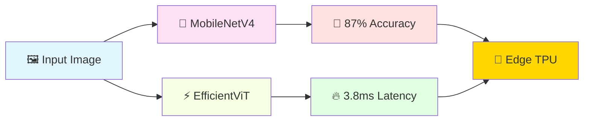
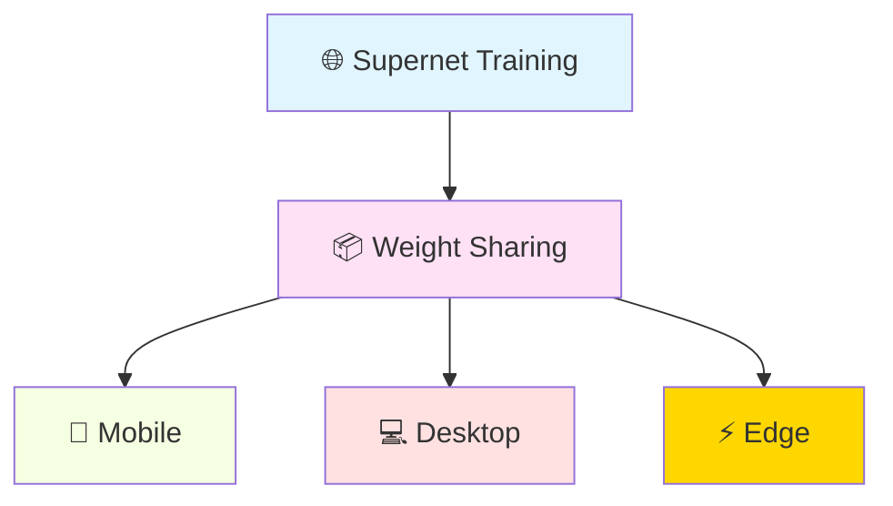

<div align="center">

# 🚀 AI Edge Computing & TinyML
### *Comprehensive Guide to State-of-the-Art Edge AI*


[](https://github.com/umitkacar/ai-edge-computing-tiny-embedded/stargazers)
[](https://github.com/umitkacar/ai-edge-computing-tiny-embedded/network/members)
[](LICENSE)
[](https://github.com/umitkacar/ai-edge-computing-tiny-embedded)

---

### 🌟 **Latest Update: January 2025**
> **Production-Ready Python Implementation** with modern tooling (Hatch, Ruff, Mypy)
> **62/62 Tests Passing** • **81.76% Coverage** • **Zero Security Issues**
> **State-of-the-Art Algorithms & Trends** for Edge AI and Embedded Systems

</div>

---

## 📋 **Table of Contents**

<table>
<tr>
<td width="33%" valign="top">

### 🚀 **Getting Started**
- [📦 Installation](#-installation)
- [🛠️ Development Setup](#%EF%B8%8F-development-setup)
- [📊 Project Structure](#-project-structure)
- [✅ Quality Assurance](#-quality-assurance)
- [🎯 Features & Examples](#-features)

</td>
<td width="33%" valign="top">

### 🔥 **Core Topics**
- [🎯 SOTA Models 2024-2025](#-sota-models--algorithms-2024-2025)
- [👁️ Object Detection](#-object-detection-models)
- [🤖 Small Language Models](#-small-language-models-slms-for-edge)
- [⚡ State Space Models](#-state-space-models---efficient-transformers)

</td>
<td width="33%" valign="top">

### 🛠️ **Frameworks & Tools**
- [🚀 Inference Frameworks](#-inference-frameworks--runtimes)
- [🔧 Model Optimization](#-model-compression--optimization)
- [💻 Hardware Platforms](#-hardware-acceleration--platforms)
- [🌐 Deployment Tools](#-edge-deployment-frameworks)

</td>
</tr>
<tr>
<td width="33%" valign="top">

### 📚 **Documentation**
- [📄 CHANGELOG.md](CHANGELOG.md)
- [📚 LESSONS-LEARNED.md](LESSONS-LEARNED.md)
- [🔧 DEVELOPMENT.md](DEVELOPMENT.md)

</td>
<td width="33%" valign="top">

### 📚 **Resources**
- [🎯 TinyML & MCU](#-tinyml--mcu-specific-advances)
- [⚙️ Compilers](#%EF%B8%8F-compilers--low-level-frameworks)
- [📄 Research Papers](#-research-papers--academic-resources)

</td>
<td width="33%" valign="top">

### 🎓 **Community**
- [🤝 Contributing](#-contributing--community)
- [📊 Repository Stats](#-repository-stats)
- [🏷️ Keywords](#%EF%B8%8F-keywords)

</td>
</tr>
</table>

---

<div align="center">

## 🚀 **Quick Start & Development**


</div>

### 📦 **Installation**

This project uses modern Python tooling with [Hatch](https://hatch.pypa.io/) for dependency management and development workflows.

```bash
# Clone the repository
git clone https://github.com/umitkacar/ai-edge-computing-tiny-embedded.git
cd ai-edge-computing-tiny-embedded

# Install dependencies (using hatch)
pip install hatch

# Run tests
hatch run test

# Run full CI pipeline
hatch run ci
```

### 🛠️ **Development Setup**

**Modern Python Stack:**
- **Build System:** [Hatch](https://hatch.pypa.io/) - Modern Python project manager
- **Linting:** [Ruff](https://docs.astral.sh/ruff/) - Ultra-fast Python linter (100x faster than flake8)
- **Formatting:** [Black](https://black.readthedocs.io/) - The uncompromising code formatter
- **Type Checking:** [Mypy](https://mypy.readthedocs.io/) - Static type checker (strict mode)
- **Testing:** [Pytest](https://docs.pytest.org/) - Comprehensive test framework
- **Security:** [Bandit](https://bandit.readthedocs.io/) - Security vulnerability scanner
- **Pre-commit:** Automated quality checks on commit/push

**Available Commands:**

```bash
# Linting & Formatting
hatch run lint          # Run Ruff linter
hatch run format        # Format code with Black
hatch run format-check  # Check formatting without changes

# Type Checking
hatch run type-check    # Run Mypy strict type checking

# Testing
hatch run test                    # Run tests (sequential)
hatch run test-parallel           # Run tests with auto workers
hatch run test-parallel-cov       # Parallel tests with coverage

# Security
hatch run security      # Run Bandit security audit

# Complete CI Pipeline
hatch run ci           # Run all checks (format, lint, type-check, security, test)
```

### 📊 **Project Structure**

```
ai-edge-computing-tiny-embedded/
├── src/ai_edge_tinyml/          # Source code (src layout)
│   ├── __init__.py              # Package initialization
│   ├── quantization.py          # INT8/INT4/FP16 quantization
│   ├── model_optimizer.py       # Model optimization pipeline
│   ├── utils.py                 # Utility functions
│   └── py.typed                 # PEP 561 marker (typed package)
├── tests/                       # Test suite (62 tests, 81.76% coverage)
│   ├── conftest.py              # Pytest configuration & fixtures
│   ├── test_quantization.py     # Quantization tests (21 tests)
│   ├── test_model_optimizer.py  # Optimizer tests (19 tests)
│   └── test_utils.py            # Utility tests (22 tests)
├── pyproject.toml               # Project configuration (single source of truth)
├── .pre-commit-config.yaml      # Pre-commit hooks configuration
├── CHANGELOG.md                 # Detailed change history
├── LESSONS-LEARNED.md           # Best practices & insights
├── DEVELOPMENT.md               # Development guidelines
└── README.md                    # This file
```

### ✅ **Quality Assurance**

This project maintains production-ready code quality:

| Check | Status | Details |
|-------|--------|---------|
| **Ruff Linting** | ✅ PASS | 50+ rules, zero errors |
| **Black Formatting** | ✅ PASS | Line length: 100 |
| **Mypy Type Check** | ✅ PASS | Strict mode enabled |
| **Bandit Security** | ✅ PASS | 0 vulnerabilities |
| **Test Suite** | ✅ PASS | 62/62 tests passing |
| **Code Coverage** | ✅ PASS | 81.76% (exceeds 80%) |
| **Pre-commit Hooks** | ✅ PASS | 15+ automated checks |

**Test Results:**
```
tests/test_quantization.py      21 passed
tests/test_model_optimizer.py   19 passed
tests/test_utils.py             22 passed
━━━━━━━━━━━━━━━━━━━━━━━━━━━━━━━━━━━━━━━━━━━━
Total: 62 passed in 0.50s ✅
Coverage: 81.76% (exceeds 80% threshold) ✅
```

### 🔒 **Security**

- **Bandit Security Audit:** Zero vulnerabilities detected
- **Type Safety:** Full type annotations with mypy strict mode
- **Dependency Scanning:** Automated security checks in CI
- **Pre-commit Hooks:** Security validations before commit

### 📚 **Documentation**

- **[CHANGELOG.md](CHANGELOG.md)** - Detailed version history and changes
- **[LESSONS-LEARNED.md](LESSONS-LEARNED.md)** - Best practices, insights, and technical decisions
- **[DEVELOPMENT.md](DEVELOPMENT.md)** - Comprehensive development guidelines
- **API Documentation:** Auto-generated from Google-style docstrings

### 🎯 **Features**

**Quantization Support:**
- ✅ INT8 Quantization (8-bit integers)
- ✅ INT4 Quantization (4-bit integers)
- ✅ FP16 Quantization (16-bit floats)
- ✅ Dynamic Quantization
- ✅ Symmetric & Asymmetric modes
- ✅ Per-tensor & per-channel quantization

**Model Optimization:**
- ✅ Weight quantization with 6 different modes
- ✅ Compression ratio analysis
- ✅ Model size calculation
- ✅ Type-safe APIs with full annotations
- ✅ Comprehensive error handling

**Example Usage:**

```python
import numpy as np
from ai_edge_tinyml import Quantizer, QuantizationConfig, QuantizationMode

# Create quantization config
config = QuantizationConfig(
    mode=QuantizationMode.INT8,
    symmetric=True,
    per_channel=False
)

# Initialize quantizer
quantizer = Quantizer(config)

# Quantize weights
weights = np.random.randn(100, 100).astype(np.float32)
quantized = quantizer.quantize(weights)

# Dequantize for inference
dequantized = quantizer.dequantize(quantized)

# Calculate compression
from ai_edge_tinyml.utils import calculate_compression_ratio
ratio = calculate_compression_ratio(weights, quantized)
print(f"Compression ratio: {ratio:.2f}x")
```

---

<div align="center">

## 🔥 **SOTA Models & Algorithms (2024-2025)**


</div>

---

### 🎯 **Object Detection Models**

<table>
<tr>
<td width="50%">

#### 🥇 **YOLOv11 (YOLO11)**


> 🚀 State-of-the-art real-time object detection with transformer-based improvements

**✨ Key Features:**
- ⚡ Transformer-based backbone with C3k2 blocks
- 🎯 Partial Self-Attention (PSA) mechanism
- 🔥 NMS-free training with dual label assignment
- 📉 **25-40% lower latency** vs YOLOv10
- 📊 **10-15% improvement** in mAP
- ⚡ **60+ FPS** processing capability

**📚 Resources:**
```bash
📖 Ultralytics Docs → https://docs.ultralytics.com/models/
📄 YOLO Evolution → https://arxiv.org/html/2510.09653v2
```

</td>
<td width="50%">

#### 🥈 **YOLOv10**


> ⚡ Eliminates NMS for end-to-end real-time detection

**📊 Performance Metrics:**
- 🔸 **YOLOv10s**: 1.8x faster than RT-DETR-R18
- 🔸 **YOLOv10b**: 46% less latency, 25% fewer parameters
- 🔸 **mAP Range**: 38.5 - 54.4

**📚 Resources:**
```bash
📄 Paper → https://arxiv.org/pdf/2405.14458
📖 Docs → https://docs.ultralytics.com/models/yolov10/
```

</td>
</tr>
</table>

---

#### 🤖 **RT-DETR & RT-DETRv2**


> 🎯 First practical real-time detection transformer

| Model | AP Score | FPS | Device |
|-------|----------|-----|--------|
| RT-DETR | **53.1%** | 108 | NVIDIA T4 |
| RT-DETRv2 | **>55%** | 108+ | NVIDIA T4 |

**🔗 Resources:**
- 📊 [RT-DETR vs YOLO11 Comparison](https://docs.ultralytics.com/compare/rtdetr-vs-yolo11/)

---

### 📱 **Efficient Vision Models for Edge**

<div align="center">



</div>

---

<table>
<tr>
<td width="50%" valign="top">

#### 📱 **MobileNetV4**


> 🌐 Universal efficient architecture for mobile ecosystem

**🎨 Innovations:**
- 🔹 Universal Inverted Bottleneck (UIB) block
- ⚡ Mobile MQA attention (**39% speedup**)
- 🎯 Optimized NAS recipe
- 🏆 **87% ImageNet accuracy** @ 3.8ms (Pixel 8 EdgeTPU)

**📚 Resources:**
- 📄 [MobileNetV4 Paper (Springer)](https://link.springer.com/chapter/10.1007/978-3-031-73661-2_5)
- 🔬 [Google Research](https://syncedreview.com/2024/04/18/87-imagenet-accuracy-3-8ms-latency-googles-mobilenetv4-redefines-on-device-mobile-vision/)

</td>
<td width="50%" valign="top">

#### ⚡ **EfficientViT**


> 🧠 Lightweight multi-scale attention for high-resolution tasks

**✨ Features:**
- 🔸 Memory-efficient Vision Transformer
- 🔸 Cascaded group attention
- 🔸 Dense prediction tasks optimized
- 🔸 High-resolution image processing

</td>
</tr>
</table>

---

<div align="center">

## 🤖 **Small Language Models (SLMs) for Edge**


</div>

---

<table>
<tr>
<td width="50%">

### 🧠 **Microsoft Phi-3**


**📊 Variants:**
```yaml
Model: Phi-3-mini
Parameters: 3.8B
Context: Up to 128K tokens
Deployment: GPU, CPU, Mobile
Status: ✅ Production Ready
```

**🎯 Optimized For:**
- 💻 GPU acceleration
- 🖥️ CPU inference
- 📱 Mobile deployment

**🔗 Resources:**
- [Phi-3 Overview](https://datasciencedojo.com/blog/small-language-models-phi-3/)

</td>
<td width="50%">

### 🦙 **TinyLlama**


**📊 Specifications:**
```yaml
Parameters: 1.1B
Target: Mobile/Edge devices
Performance: High for size class
Year: 2024
Status: ✅ Active
```

**✨ Highlights:**
- 🔸 Compact architecture
- 🔸 Edge-optimized
- 🔸 Strong performance/size ratio

</td>
</tr>
<tr>
<td width="50%">

### 🌟 **Google Gemini Nano**


**📱 On-device AI for Smartphones**

**Variants:**
- 📊 **1.8B** parameters (lightweight)
- 📊 **3.25B** parameters (standard)

**🎯 Capabilities:**
- ✅ Context-aware reasoning
- ✅ Real-time translation
- ✅ Text summarization
- ✅ Edge-optimized for phones/IoT

</td>
<td width="50%">

### 🦙 **Meta Llama 3.2**


**🖼️ Edge AI & Vision Capabilities**

**Features:**
- ⚡ Edge deployment optimized
- 👁️ Vision-language capabilities
- 📱 Mobile-friendly variants
- 🔥 Latest architecture

**🔗 Resources:**
- [Llama 3.2 Announcement](https://ai.meta.com/blog/llama-3-2-connect-2024-vision-edge-mobile-devices/)

</td>
</tr>
</table>

---

### 📷 **MobileVLM**


> 🎨 Efficient vision-language model for mobile devices

**Specifications:**
- 🔹 **mobileLLaMA**: 2.7B parameters
- 🔹 Trained from scratch on open datasets
- 🔹 Fully optimized for mobile deployment
- 🔹 Vision + Language capabilities

---

<div align="center">

## ⚡ **State Space Models - Efficient Transformers**


</div>

---

<table>
<tr>
<td width="50%">

### 🐍 **Mamba**


> ⚡ Linear-time sequence modeling with selective state spaces

**🚀 Performance Highlights:**

| Metric | Performance |
|--------|-------------|
| Throughput | **5x higher** than Transformers |
| Scaling | **Linear** in sequence length |
| Comparison | Mamba-3B > Transformers (same size) |
| Power | Matches Transformers 2x its size |

**📊 Advantages:**
```diff
+ ✅ Linear time complexity
+ ✅ 5x throughput improvement
+ ✅ Efficient long sequences
+ ✅ Lower memory footprint
- ❌ Newer architecture (less tested)
```

**📚 Resources:**
- 📄 [Mamba Paper](https://arxiv.org/abs/2312.00752)
- 💻 [Mamba GitHub](https://github.com/state-spaces/mamba)
- 📖 [Mamba Survey](https://arxiv.org/html/2408.01129v1)

</td>
<td width="50%">

### 📱 **eMamba**


> 🔧 Edge-optimized Mamba acceleration framework

**✨ Features:**
```yaml
Design: End-to-end hardware acceleration
Target: Edge platforms
Complexity: Linear time
Status: 2024 Release
```

**🎯 Optimizations:**
- 🔹 Hardware-aware design
- 🔹 Edge platform specific
- 🔹 Leverages linear complexity
- 🔹 Memory efficient

**📚 Resources:**
- 📄 [eMamba Paper](https://arxiv.org/html/2508.10370)

</td>
</tr>
</table>

---

<div align="center">

## 🚀 **Inference Frameworks & Runtimes**


</div>

---

<table>
<tr>
<td width="50%">

### ⚡ **TensorRT-LLM**


> 🏆 High-performance LLM inference on NVIDIA GPUs

**📊 Performance:**
```diff
+ 70% faster than llama.cpp on RTX 4090
+ State-of-the-art optimizations
+ Quality maintained across precisions
```

**✨ Features:**
- 🔸 Python & C++ API
- 🔸 Multi-precision support
- 🔸 Advanced kernel optimization
- 🔸 Production-grade quality

**🔗 Resources:**
- [TensorRT-LLM GitHub](https://github.com/NVIDIA/TensorRT-LLM)
- [Deployment Guide](https://towardsdatascience.com/deploying-llms-into-production-using-tensorrt-llm-ed36e620dac4/)

</td>
<td width="50%">

### 📄 **vLLM**


> 💡 High-throughput LLM serving with PagedAttention

**🎯 Innovations:**
- ⚡ PagedAttention memory management
- 🔸 Optimized KV cache handling
- 🌐 Multi-platform support

**🖥️ Supported Hardware:**
```yaml
AMD: GPU support
Google: TPU support
AWS: Inferentia support
Base: PyTorch
```

**🔗 Resources:**
- [vLLM vs TensorRT-LLM](https://northflank.com/blog/vllm-vs-tensorrt-llm-and-how-to-run-them)

</td>
</tr>
<tr>
<td width="50%">

### 🦙 **ExecuTorch**


> 📱 Efficient LLM execution on edge devices

**Features:**
- 🔹 Lightweight edge runtime
- 🔹 Static memory planning
- 🔹 Multi-platform support
- 🔹 TorchAO quantization

**💻 Hardware Support:**
- ✅ CPU
- ✅ GPU
- ✅ AI Accelerators
- ✅ Mobile devices

**🔗 Resources:**
- [PyTorch Conference 2024](https://www.infoq.com/news/2024/09/pytorch-conference-2024/)

</td>
<td width="50%">

### 💻 **llama.cpp**


> ⚡ CPU-optimized LLM inference

**Advantages:**
```diff
+ ✅ Lower memory usage
+ ✅ No GPU required
+ ✅ Fast generation
+ ✅ Cross-platform
+ ✅ Wide model support
```

**🔗 Comparison:**
- [vLLM vs Ollama vs llama.cpp vs TGI vs TensorRT-LLM](https://itecsonline.com/post/vllm-vs-ollama-vs-llama.cpp-vs-tgi-vs-tensort)

</td>
</tr>
</table>

---

<div align="center">

## 🔧 **Model Compression & Optimization**


</div>

---

### 📉 **Advanced Quantization Techniques**

<table>
<tr>
<td width="33%">

#### 🏆 **AWQ**


**Activation-aware Weight Quantization**

> 🎯 MIT HAN Lab Innovation

**Key Concept:**
```python
# Not all weights are equal!
if is_salient(weight):
    skip_quantization()
else:
    quantize_weight()
```

**Features:**
- ⚡ Protects critical weights
- 🎯 Activation-aware
- 🔥 State-of-the-art results

**🔗 Resources:**
- [AWQ GitHub](https://github.com/mit-han-lab/llm-awq)
- [MIT HAN Lab](https://hanlab.mit.edu/)

</td>
<td width="33%">

#### 💎 **GPTQ**


**GPU-Focused Quantization**

**Features:**
- 🔸 Row-wise quantization
- 🔸 Hessian optimization
- 🔸 GPU inference focused
- 🔸 175B models supported

**Achievements:**
```yaml
Models: BLOOM, OPT-175B
Precision: 4-bit
Platform: GPU optimized
```

</td>
<td width="33%">

#### 🔬 **QLoRA**


**Efficient Fine-tuning**

**Innovations:**
- ✨ 4-bit NormalFloat (NF4)
- ✨ Double quantization
- ✨ LoRA adapters
- ✨ Single GPU fine-tuning

**Capability:**
```diff
+ Fine-tune 65B model
+ On single GPU
+ Maintain quality
```

</td>
</tr>
</table>

---

#### 🆕 **Unsloth Dynamic 4-bit**


> 🔥 Latest quantization innovation

**Features:**
- Built on BitsandBytes
- Dynamic parameter quantization
- Per-parameter optimization

**📚 Comprehensive Guides:**
- 📖 [Quantization Comparison](https://generativeai.pub/practical-guide-of-llm-quantization-gptq-awq-bitsandbytes-and-unsloth-bdeaa2c0bbf6)
- 📊 [GPTQ vs GGUF vs AWQ](https://newsletter.maartengrootendorst.com/p/which-quantization-method-is-right)

---

### 🔬 **Neural Architecture Search (NAS)**

<div align="center">


</div>

> 🤖 Automate neural network architecture design

#### 🎯 **Once-for-All (OFA)**

**Concept:** Train once, deploy everywhere



**Features:**
- 🔹 Weight-sharing supernetwork
- 🔹 Represents any architecture in search space
- 🔹 Massive computational savings
- 🔹 Applied to ImageNet with ProxylessNAS & MobileNetV3

**🔗 Resources:**
- [NAS Overview](https://www.automl.org/nas-overview/)
- [MIT HAN Lab NAS](https://hanlab.mit.edu/techniques/nas)

---

### 🎓 **Knowledge Distillation & Pruning**

<table>
<tr>
<td width="50%">

#### 🔬 **TinyBERT**


> 📚 Two-stage distillation approach

**Performance Metrics:**
```yaml
Accuracy: 96.8% of BERT-base
Size: 7.5x smaller (4 layers)
Energy: Lowest variability (0.1032 kWh SD)
Stages: Task-agnostic + Task-specific
```

**Advantages:**
- ✅ Dual-stage distillation
- ✅ Ultra-low energy variability
- ✅ Compact architecture
- ✅ High performance retention

</td>
<td width="50%">

#### 📖 **DistilBERT**


> ⚡ Single-phase task-agnostic distillation

**Performance Metrics:**
```yaml
Accuracy: 97% of BERT
Size Reduction: 40% smaller
Speed: 60% faster
Use Case: General-purpose
```

**Recent Research (2025):**
- 🔸 32% energy reduction with pruning
- 🔸 Iterative distillation + adaptive pruning
- 🔸 Nature Scientific Reports

</td>
</tr>
</table>

**📚 Resources:**
- [Nature Scientific Reports 2025](https://www.nature.com/articles/s41598-025-07821-w)
- [DistilBERT Medium](https://medium.com/huggingface/distilbert-8cf3380435b5)

---

<div align="center">

## 🎯 **TinyML & MCU-specific Advances**


</div>

---

### 🧠 **MCUNet Series** - MIT HAN Lab

<table>
<tr>
<td width="33%">

#### 📱 **MCUNetV1**


**Foundation:**
- 🔸 Neural architecture for MCUs
- 🔸 Co-designed model + inference engine
- 🔸 Ultra-low memory footprint

</td>
<td width="33%">

#### 🚀 **MCUNetV2**


**Achievements:**
```yaml
ImageNet: 71.8% accuracy
Visual Wake: >90% (32kB SRAM)
Capability: Object detection
Platform: Tiny devices
```

</td>
<td width="33%">

#### ⚡ **MCUNetV3**


**Latest:**
- 🔸 Enhanced efficiency
- 🔸 State-of-the-art MCU AI
- 🔸 Production ready

</td>
</tr>
</table>

---

#### 🎓 **Additional MCU Tools**

<table>
<tr>
<td width="50%">

**🔧 TinyTL**
- Tiny transfer learning for MCUs
- On-device learning capabilities
- Minimal resource overhead

</td>
<td width="50%">

**⚙️ PockEngine**
- Inference engine optimization
- MCU-specific acceleration
- Memory-efficient execution

</td>
</tr>
</table>

**📚 Resources:**
- 🌐 [MCUNet Official](https://mcunet.mit.edu/)
- 💻 [MCUNet GitHub](https://github.com/mit-han-lab/mcunet)
- 📖 [TinyML Projects](https://hanlab.mit.edu/projects/tinyml)

---

### 🔬 **TinyDL (Tiny Deep Learning)**


> 🎯 Evolution from TinyML to deep learning on edge

**Focus Areas:**
- 🔹 Deep learning on ultra-constrained hardware
- 🔹 Power consumption in **mW range**
- 🔹 On-device sensor analytics
- 🔹 Real-time inference

**📄 Resources:**
- [TinyDL Survey](https://arxiv.org/html/2506.18927v1)

---

<div align="center">

## 🔩 **Hardware Acceleration & Platforms**


</div>

---

### 🖥️ **Edge AI Platforms**

<table>
<tr>
<td width="50%">

#### 🟢 **NVIDIA Jetson Orin Nano Super**


**Specifications:**
```yaml
Compute: 67 INT8 TOPS
Performance: 1.7x vs previous Orin
Price: $249
Release: Late 2024
Status: ✅ Available
```

**Features:**
- ⚡ Generative AI optimized
- 🎯 Edge AI development kit
- 💰 Affordable price point

</td>
<td width="50%">

#### 🔷 **Edge TPU & Neural Accelerators**

**Hardware Platforms:**


- Google Pixel EdgeTPU
- Coral Dev Board


- Apple Neural Engine
- A-series chips


- Specialized NPUs
- Custom ASICs

</td>
</tr>
</table>

---

### 📱 **Mobile Deployment Targets**

<div align="center">

| Platform | Architecture | Use Case |
|----------|-------------|----------|
| 🔧 **ARM CPUs** | ARM Cortex | General compute |
| 📡 **Mobile DSPs** | Qualcomm/MediaTek | Signal processing |
| 🎮 **Mobile GPUs** | Mali/Adreno | Graphics + AI |
| 🧠 **NPUs** | Custom ASICs | Neural processing |

</div>

---

<div align="center">

## 🛠️ **Implementation Resources & Tools**


</div>

---

### 🔷 **ONNX Runtime**

> Cross-platform inference with ONNX models

<table>
<tr>
<td width="50%" valign="top">

#### 📚 **Documentation & Tutorials**
- 📖 [ONNX Runtime C++ Inference](https://leimao.github.io/blog/ONNX-Runtime-CPP-Inference/)
- 🐍 [PyTorch to ONNX Tutorial](https://pytorch.org/tutorials/advanced/super_resolution_with_onnxruntime.html)
- 📝 [ONNX Registry Tutorial](https://pytorch.org/tutorials/beginner/onnx/onnx_registry_tutorial.html)
- 🎓 [On-Device Training](https://onnxruntime.ai/docs/api/python/on_device_training/training_artifacts.html)

#### 🔧 **Compatibility**
- ⚙️ [ONNX Runtime Compatibility](https://onnxruntime.ai/docs/reference/compatibility.html)
- 📋 [ONNX Versioning](https://github.com/onnx/onnx/blob/main/docs/Versioning.md)
- 🚀 [CUDA Execution Provider](https://onnxruntime.ai/docs/execution-providers/CUDA-ExecutionProvider.html)

</td>
<td width="50%" valign="top">

#### 💻 **Example Implementations**
- 🖼️ [C++ ResNet Console App](https://github.com/cassiebreviu/cpp-onnxruntime-resnet-console-app)
- ⚡ [ONNX Runtime C++ Example](https://github.com/k2-gc/onnxruntime-cpp-example)
- 🤖 [ONNX Runtime Android](https://github.com/Rohithkvsp/OnnxRuntimeAndorid)
- 🎯 [ByteTrack ONNX Inference](https://github.com/ifzhang/ByteTrack/blob/main/deploy/ONNXRuntime/onnx_inference.py)

#### 📦 **Model Repositories**
- 🤗 [HuggingFace ONNX Models](https://huggingface.co/models?sort=trending&search=onnx)
- 🔧 [txtai ONNX Pipeline](https://neuml.github.io/txtai/pipeline/train/hfonnx/)
- 📤 [Ultralytics Export](https://docs.ultralytics.com/modes/export/#arguments)

</td>
</tr>
</table>

---

### 📉 **ONNX Runtime Quantization**


**Tools & Resources:**
- 🔧 [Quantization Tools](https://github.com/microsoft/onnxruntime/tree/main/onnxruntime/python/tools/quantization)
- 📊 [Float16 Optimization](https://onnxruntime.ai/docs/performance/model-optimizations/float16.html)
- 💡 [Quantization Examples](https://github.com/microsoft/onnxruntime-inference-examples/tree/main/quantization)

---

### 🎯 **YOLO Implementations**

<details>
<summary><b>🔥 Click to expand YOLO implementations</b></summary>

<br>

#### 🟣 **YOLO-NAS with ONNX**
- 💻 [YOLO-NAS ONNXRuntime](https://github.com/jason-li-831202/YOLO-NAS-onnxruntime)

#### 🟢 **YOLO + TensorRT** (Detection, Pose, Segmentation)
- ⚡ [YOLOv8-TensorRT-CPP](https://github.com/cyrusbehr/YOLOv8-TensorRT-CPP)
- 🔧 [TensorRT C++ API](https://github.com/cyrusbehr/tensorrt-cpp-api)
- 🐍 [YOLOv8-TensorRT (Python + C++)](https://github.com/triple-Mu/YOLOv8-TensorRT)
- 🤸 [YOLO Pose C++](https://github.com/mattiasbax/yolo-pose_cpp)
- 📚 [TensorRT Samples](https://github.com/NVIDIA/TensorRT/tree/main/samples/trtexec)
- 📺 [YOLOv8 TensorRT Tutorial](https://www.youtube.com/watch?v=Z0n5aLmcRHQ)

#### 🔵 **YOLO + ONNXRuntime** (All Tasks)
- 💻 [YOLOv8-ONNX-CPP](https://github.com/FourierMourier/yolov8-onnx-cpp/tree/main)
- 🤸 [YOLOv8 Pose Implementation](https://github.com/mallumoSK/yolov8/blob/master/yolo/YoloPose.cpp)
- ⚡ [YOLOv8 TensorRT Pose](https://github.com/triple-Mu/YOLOv8-TensorRT/blob/main/csrc/pose/normal/main.cpp)
- 🔧 [YOLO-ONNXRuntime-CPP](https://github.com/Amyheart/yolo-onnxruntime-cpp)
- 📷 [YOLOv8-OpenCV-ONNXRuntime-CPP](https://github.com/UNeedCryDear/yolov8-opencv-onnxruntime-cpp)
- 📖 [Ultralytics YOLOv8 C++](https://github.com/ultralytics/ultralytics/tree/main/examples/YOLOv8-ONNXRuntime-CPP)
- 🎯 [YOLOv6-OpenCV-ONNXRuntime](https://github.com/hpc203/yolov6-opencv-onnxruntime/tree/main)
- 🏃 [YOLOv5 Pose OpenCV](https://github.com/hpc203/yolov5_pose_opencv)

#### 🌐 **Community Resources**
- 👨‍💻 [hpc203 Repositories](https://github.com/hpc203?tab=repositories)
- 💬 [YOLO Issue Discussions](https://github.com/ultralytics/ultralytics/issues/1852)
- 🐛 [YOLOv5 Fixed Bugs](https://github.com/ultralytics/yolov5/issues/916)
- 🇨🇳 [Chinese Tutorial](https://zhuanlan.zhihu.com/p/466677699)
- 📦 [ONNX Runtime Install Guide](https://velog.io/@dnchoi/ONNX-runtime-install)

</details>

---

### ⚡ **TensorRT**


> 🚀 NVIDIA's high-performance deep learning inference optimizer

**Resources:**
- 🔧 [TensorRT Execution Provider](https://onnxruntime.ai/docs/execution-providers/TensorRT-ExecutionProvider.html#requirements)
- 💾 [TensorRT Engine Cache](https://gitee.com/arnoldfychen/onnxruntime/blob/master/docs/execution_providers/TensorRT-ExecutionProvider.md#specify-tensorrt-engine-cache-path)

---

<div align="center">

## 🌐 **Edge Deployment Frameworks**


</div>

---

<table>
<tr>
<td width="50%">

### 🚀 **FastDeploy** - PaddlePaddle


> 📦 Easy-to-use deployment toolbox for AI models

**Resources:**
- 💻 [FastDeploy GitHub](https://github.com/PaddlePaddle/FastDeploy)
- 📥 [Prebuilt Libraries](https://github.com/PaddlePaddle/FastDeploy/blob/develop/docs/en/build_and_install/download_prebuilt_libraries.md)

---

### 💎 **DeepSparse & SparseML** - Neural Magic


> 🖥️ CPU-optimized inference with sparsity

**Features:**
- ⚡ CPU inference acceleration
- 🔸 Sparsity-aware optimization
- 📊 YOLOv5 CPU benchmarks

**Resources:**
- 📈 [YOLOv5 CPU Benchmark](https://neuralmagic.com/blog/benchmark-yolov5-on-cpus-with-deepsparse/)
- 💻 [SparseML GitHub](https://github.com/neuralmagic/sparseml/tree/main)
- 🚀 [DeepSparse GitHub](https://github.com/neuralmagic/deepsparse)

</td>
<td width="50%">

### 📱 **NCNN** - Tencent


> 🎯 High-performance neural network inference for mobile

**Resources:**
- 💻 [NCNN GitHub](https://github.com/Tencent/ncnn)
- 📖 [NCNN C++ Usage](https://github.com/Tencent/ncnn/blob/master/docs/how-to-use-and-FAQ/use-ncnn-with-alexnet.md)
- 📱 [YoloMobile](https://github.com/wkt/YoloMobile)
- ⭐ [Awesome NCNN](https://github.com/umitkacar/awesome-ncnn-collection)
- 🔄 [Model Converter](https://convertmodel.com/)

---

### 🔧 **MACE** - Xiaomi


> 🤖 Mobile AI Compute Engine

**Resources:**
- 💻 [MACE GitHub](https://github.com/xiaomi/mace)

</td>
</tr>
</table>

---

### 🍎 **CoreML** - Apple


> 🎨 Machine learning framework for iOS/macOS

<details>
<summary><b>📦 Click to expand CoreML resources</b></summary>

<br>

#### 🎨 **Model Collections**
- 🎯 [Semantic Segmentation CoreML](https://github.com/tucan9389/SemanticSegmentation-CoreML)
- 📚 [CoreML Models Collection](https://github.com/john-rocky/CoreML-Models#u2net)
- ⭐ [Awesome CoreML Models](https://github.com/likedan/Awesome-CoreML-Models)
- 🧠 [Awesome CoreML Models 2](https://github.com/SwiftBrain/awesome-CoreML-models)
- 🎬 [RobustVideoMatting](https://github.com/PeterL1n/RobustVideoMatting)

#### 🛠️ **Tools & Documentation**
- 🔄 [PyTorch to CoreML](https://coremltools.readme.io/docs/pytorch-conversion)
- 🔧 [CoreML Helpers](https://github.com/hollance/CoreMLHelpers)
- 📖 [Apple ML API](https://developer.apple.com/machine-learning/api/)
- 📊 [CoreML Performance Tool](https://github.com/vladimir-chernykh/coreml-performance)

#### 🎨 **Stable Diffusion on CoreML**
- 🔬 [Apple ML-4M](https://github.com/apple/ml-4m/)
- 🎯 [Apple ML Stable Diffusion](https://github.com/apple/ml-stable-diffusion)
- 📦 [Stable Diffusion 2 Base](https://huggingface.co/stabilityai/stable-diffusion-2-base)
- 🚀 [Stability AI SD](https://github.com/Stability-AI/stablediffusion)
- 📚 [Stable Diffusion v1.4](https://huggingface.co/CompVis/stable-diffusion-v1-4)
- 🎬 [RunwayML SD](https://github.com/runwayml/stable-diffusion)
- 🖼️ [Automatic1111 WebUI](https://github.com/AUTOMATIC1111/stable-diffusion-webui)

</details>

---

<div align="center">

## ⚙️ **Compilers & Low-Level Frameworks**


</div>

---

<table>
<tr>
<td width="50%">

### 🔧 **TVM** - Apache


> 🎯 End-to-end deep learning compiler stack

**Resources:**
- [TVM GitHub](https://github.com/apache/tvm)

---

### 🔨 **LLVM**


> ⚙️ Compiler infrastructure project

**Resources:**
- [LLVM Project](https://github.com/llvm/llvm-project)

---

### ⚡ **XNNPack** - Google


> 🚀 High-efficiency floating-point neural network operators

**Resources:**
- [XNNPack GitHub](https://github.com/google/XNNPACK)

</td>
<td width="50%">

### 🔷 **ARM-NN**


> 💪 Inference engine for ARM platforms

**Resources:**
- [ARM-NN GitHub](https://github.com/ARM-software/armnn)
- [ARM-NN Tutorial](https://www.youtube.com/watch?v=QuNOaFLobSg)

---

### 🧠 **CMSIS-NN**


> 📱 Efficient neural network kernels for ARM Cortex-M

**Resources:**
- [CMSIS-NN GitHub](https://github.com/ARM-software/CMSIS_5)

---

### 📱 **Samsung ONE**


> 🔧 On-device Neural Engine compiler

**Resources:**
- [ONE GitHub](https://github.com/Samsung/ONE)

</td>
</tr>
</table>

---

<div align="center">

## 💼 **Industry & Commercial Solutions**


</div>

---

### 🚀 **Deeplite**


> 🎯 AI-Driven Optimizer for Deep Neural Networks

**Focus:**

<table>
<tr>
<td width="20%" align="center">⚡<br><b>Faster<br>Inference</b></td>
<td width="20%" align="center">📦<br><b>Smaller<br>Models</b></td>
<td width="20%" align="center">🔋<br><b>Energy<br>Efficient</b></td>
<td width="20%" align="center">☁️<br><b>Cloud to<br>Edge</b></td>
<td width="20%" align="center">🎯<br><b>Maintain<br>Accuracy</b></td>
</tr>
</table>

**🔗 Resources:**
- [Deeplite Website](https://www.deeplite.ai/)

---

<div align="center">

## 🔧 **Utility Frameworks & Tools**


</div>

---

<table>
<tr>
<td width="50%">

### 👁️ **OpenCV**


> 📷 Computer vision library with C++ support

**Resources:**
- 📺 [OpenCV C++ Playlist](https://www.youtube.com/playlist?list=PLUTbi0GOQwghR9db9p6yHqwvzc989q_mu)
- 🔨 [Build OpenCV C++](https://gist.github.com/raulqf/f42c718a658cddc16f9df07ecc627be7)

</td>
<td width="50%">

### 🎬 **VQRF** - Video Compression


> 📹 Vector Quantized Radiance Fields

**Resources:**
- [VQRF GitHub](https://github.com/AlgoHunt/VQRF)

</td>
</tr>
</table>

---

<div align="center">

## 🖼️ **Additional Model Architectures**


</div>

---

<table>
<tr>
<td width="50%">

### 🎯 **PP-PicoDet**


> 📱 Lightweight real-time object detector for mobile

**Resources:**
- [PP-PicoDet Paper](https://arxiv.org/pdf/2111.00902.pdf)

</td>
<td width="50%">

### 🔬 **EtinyNet**


> 🎯 Extremely tiny network for TinyML

**Resources:**
- [EtinyNet GitHub](https://github.com/aztc/EtinyNet)

</td>
</tr>
</table>

<div align="center">


</div>

---

<div align="center">

## 🧠 **Computing Architectures & APIs**


</div>

---

<table align="center">
<tr>
<td align="center" width="16.66%">


**Mobile &<br>Embedded**

</td>
<td align="center" width="16.66%">


**Open-Source<br>ISA**

</td>
<td align="center" width="16.66%">


**NVIDIA<br>GPU**

</td>
<td align="center" width="16.66%">


**Apple<br>GPU**

</td>
<td align="center" width="16.66%">


**Cross-<br>Platform**

</td>
<td align="center" width="16.66%">


**Graphics &<br>Compute**

</td>
</tr>
</table>

---

<div align="center">

## 📚 **Research Papers & Academic Resources**


</div>

---

### 📖 **Foundational Surveys (2024-2025)**

<details open>
<summary><b>🔍 Click to expand research papers</b></summary>

<br>

#### 🌐 **Edge Computing & Deep Learning**
- 📄 [Deep Learning With Edge Computing: A Review](https://www.cs.ucr.edu/~jiasi/pub/deep_edge_review.pdf)
- 📄 [Convergence of Edge Computing and Deep Learning](https://arxiv.org/pdf/1907.08349.pdf)
- 📄 [Machine Learning at the Network Edge](https://arxiv.org/pdf/1908.00080.pdf)
- 📄 [Edge Deep Learning in CV & Medical Diagnostics](https://link.springer.com/article/10.1007/s10462-024-11033-5)

#### 🔬 **TinyML Specific**
- 📄 [From Tiny ML to Tiny DL: A Survey (2024)](https://arxiv.org/html/2506.18927v1)
- 📄 [EtinyNet: Extremely Tiny Network](https://ojs.aaai.org/index.php/AAAI/article/download/20387/version/18684/20146)
- 📄 [Ultra-low Power TinyML System](https://arxiv.org/pdf/2207.04663.pdf)

#### ⚡ **State Space Models & Efficient Architectures**
- 📄 [Mamba: Linear-Time Sequence Modeling](https://arxiv.org/abs/2312.00752)
- 📄 [Mamba-360: Survey of SSMs](https://arxiv.org/html/2404.16112v1)
- 📄 [eMamba: Efficient Edge Acceleration](https://arxiv.org/html/2508.10370)

#### 👁️ **Vision Models**
- 📄 [MobileNetV4 (ECCV 2024)](https://link.springer.com/chapter/10.1007/978-3-031-73661-2_5)
- 📄 [ViT for Mobile/Edge Devices](https://link.springer.com/article/10.1007/s00530-024-01312-0)
- 📄 [YOLO Evolution: v5 to YOLO26](https://arxiv.org/html/2510.09653v2)
- 📄 [YOLOv10: Real-Time Detection](https://arxiv.org/pdf/2405.14458)

#### 🔧 **Model Compression & Optimization**
- 📄 [Model Compression for Carbon Efficient AI (2025)](https://www.nature.com/articles/s41598-025-07821-w)
- 📄 [NAS Systematic Review (2024)](https://link.springer.com/article/10.1007/s10462-024-11058-w)
- 📄 [Advances in Neural Architecture Search](https://academic.oup.com/nsr/article/11/8/nwae282/7740455)

#### 📚 **Collections**
- ⭐ [Awesome Embedded and Mobile Deep Learning](https://github.com/csarron/awesome-emdl/blob/master/README.md)

</details>

---

<div align="center">

## 🎓 **Contributing & Community**


</div>

---

<div align="center">

This repository serves as a **comprehensive resource** for AI edge computing and TinyML practitioners.

**Contributions, updates, and corrections are welcome!** 🚀

---

### 📊 **Repository Stats**


---

### 🏷️ **Keywords**

`TinyML` • `Edge AI` • `Embedded ML` • `Model Compression` • `Quantization` • `Neural Architecture Search` • `YOLO` • `MobileNet` • `Transformer` • `State Space Models` • `ONNX Runtime` • `TensorRT` • `Inference Optimization` • `MCU` • `IoT` • `Real-Time AI`

---

### 📅 **Last Updated**
**January 2025**

---


</div>
