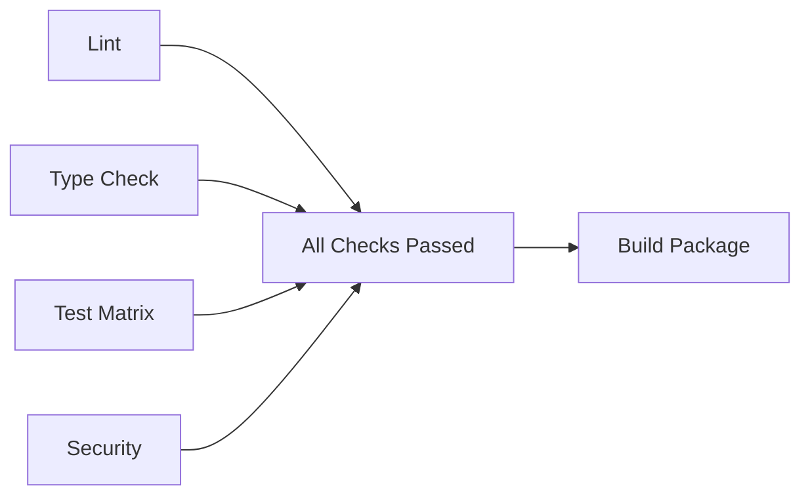

# GitHub Actions Workflows

This directory contains example GitHub Actions workflows for CI/CD.

## 📋 Setup Instructions

### Adding the CI Workflow

To enable GitHub Actions CI/CD, you need to:

1. **Grant workflow permissions** to your GitHub App or token
2. Copy the example workflow to your repository:

```bash
mkdir -p .github/workflows
cp docs/workflows/ci.yml.example .github/workflows/ci.yml
git add .github/workflows/ci.yml
git commit -m "chore(ci): add GitHub Actions workflow"
git push
```

### Required Permissions

The workflow requires the following permissions:
- `contents: write` - For pushing changes
- `workflows: write` - For managing workflows
- `pull-requests: write` - For PR comments (optional)

### Workflow Features

The CI workflow (`ci.yml.example`) includes:

#### ✅ **Lint & Format Check**
- Runs Ruff linter
- Checks Black formatting
- Runs on every push and PR

#### ✅ **Type Checking**
- Runs Mypy in strict mode
- Validates all type annotations

#### ✅ **Multi-Platform Testing**
- Tests on Linux, macOS, and Windows
- Tests Python 3.10, 3.11, and 3.12
- Generates coverage reports
- Uploads to Codecov

#### ✅ **Security Scanning**
- Runs Bandit security checks
- Scans for common vulnerabilities

#### ✅ **Package Building**
- Builds wheel and source distributions
- Validates package with twine

#### ✅ **Documentation Build**
- Validates documentation can be built

## 🔧 Customization

### Adding Codecov Integration

1. Sign up at [codecov.io](https://codecov.io)
2. Add your repository
3. The workflow will automatically upload coverage

### Adding Secrets

For PyPI publishing or other features, add secrets:

1. Go to repository Settings → Secrets and variables → Actions
2. Add secrets like `PYPI_API_TOKEN`
3. Reference in workflow: `${{ secrets.PYPI_API_TOKEN }}`

### Matrix Testing

Current matrix configuration:

```yaml
strategy:
  matrix:
    os: [ubuntu-latest, macos-latest, windows-latest]
    python-version: ["3.10", "3.11", "3.12"]
```

You can customize this based on your needs.

## 📊 Badge Integration

Add status badges to your README:

```markdown

[](https://codecov.io/gh/umitkacar/ai-edge-computing-tiny-embedded)
```

## 🚀 Running Workflows

### Triggering Workflows

Workflows run automatically on:
- Push to `main` or `develop` branches
- Pull requests to `main` or `develop`
- Manual trigger via GitHub UI (workflow_dispatch)

### Manual Trigger

You can manually trigger workflows from:
1. GitHub repository → Actions tab
2. Select workflow
3. Click "Run workflow"

## 📝 Workflow Jobs

### Job Dependencies



### Workflow Stages

1. **Quality Checks** (parallel)
   - Linting
   - Type checking
   - Security scanning

2. **Testing** (matrix)
   - Multi-OS testing
   - Multi-Python version testing
   - Coverage reporting

3. **Build & Validate**
   - Package building
   - Distribution validation

4. **Success Gate**
   - All checks must pass

## 🔍 Troubleshooting

### Workflow Permission Issues

If you get permission errors:

```
refusing to allow a GitHub App to create or update workflow without workflows permission
```

**Solution:**
1. Go to repository Settings → Actions → General
2. Under "Workflow permissions", select "Read and write permissions"
3. Check "Allow GitHub Actions to create and approve pull requests"
4. Save changes

### Failed Tests

Check the Actions tab for detailed logs:
1. Go to Actions tab
2. Click on failed workflow
3. Expand failed job
4. Review error messages

### Slow Workflows

Optimize by:
- Using caching for dependencies
- Running fewer OS combinations
- Reducing Python version matrix
- Parallelizing independent jobs

## 📚 References

- [GitHub Actions Documentation](https://docs.github.com/en/actions)
- [Python Actions Examples](https://github.com/actions/starter-workflows/tree/main/ci)
- [Codecov GitHub Action](https://github.com/codecov/codecov-action)
